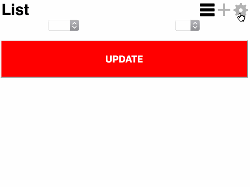

# Todoist Fridge

Simple app to keep track of list of items in the fridge, with ability to set current amount, with ability to sync via todoist, to always  have the needed list of items to buy in the grocery store.

# Setup

- Get your todoist API key [here](https://todoist.com/prefs/integrations)
- Open [todoist-fridge](https://dkunin.github.io/todoist-fridge)
- Open preferences with this icon: 
- Enter your API key, and list query e.g. #products, for all your items under "products" project list
- Open list again, you should now see your list

# Roadmap

- [x] Integration with Todoist, methods: 
    - [x] GET list of items, provided client has API code and project id
    - [x] GET list of labels
    - [x] PUT item with label, on each update or periodicaly
    - [x] Settings page, where you can set API and project settings
- [ ] Design
- [x] Service worker

